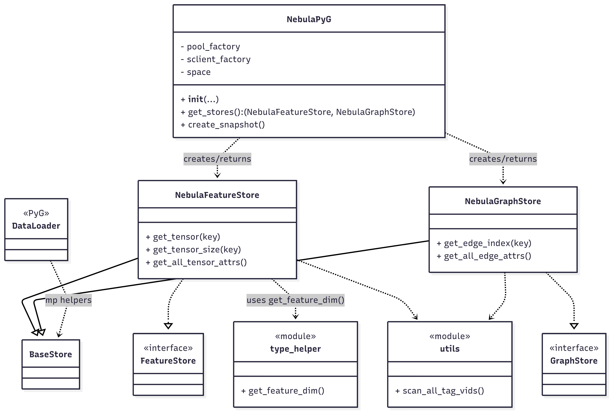

+++
title = "NebulaGraph × PyG"
date = 2025-08-18T03:58:00+08:00
draft = false
categories = ["Tech"]
tags = ["NebulaGraph","PyG","GNN"]
toc = true
image = "cover.png" 
+++

这篇文章更像一个“反思录”，记录一下整个 [nebula-pyg](https://github.com/Fengzdadi/nebula-pyg) 的开发过程。

## 初逢
还是要先感谢 [OSPP](https://summer-ospp.ac.cn/) 这个平台，让我遇见了 NebulaGraph 社区和 wey-gu老师。

当然，项目还是需要竞争的，记得最初钟意的项目有 Kwok 的 “为 KWOK 添加 模拟真实 Pod 行为的策略配置”，以及现在就在做的 
“NebulaGraph PyG Integration”。

我是那种非常害怕竞争的人，要面试，讲想法（其实就是太菜了，如果你够了解，对这些东西应该是侃侃而谈的）。
即使我非常想尝试云原生相关的内容，最后因为觉得自己不熟练，放弃了，转而投向我更熟悉的 PyG 。

现在去查了一下 四月份和 wey-gu老师 交流的邮件，来回总共七封，我竟然写了五封哈哈，其中第一封被错过了，大概十天后进行了 follow-up。得到了回复。
客观点来说，我现在看当时的邮件，感觉我像是早早滚蛋的样子。

后来加上了X，老师的交流一下子就轻松了很多，简单说明了一下我的想法后，就开始等待第一次的线上交流。

这次交流也是很意外的一件事哈哈，好像我并没有被通知到具体在几点参加会议，然后立马找了个咖啡厅进去，一脸懵逼的进，一脸懵逼的出。

交流的时候，发现和我一起参与这个项目的两位也都很厉害，并且其中一位，在后续开发过程中，在一些相关搜索的时候，Google到了。
能通过他的Blog，他在准备的时候也做了好多相关工作。

那我也是很辛运的一位了!

（突然想知道为什么是我入选哈哈哈）

接着就是长时间的等待结果了。录取！

## 设计
这个项目的设计，整体上是参考了 [KUZU](https://blog.kuzudb.com/post/kuzu-pyg-remote-backend/) 所做的，给 PyG 做 remote 适配的工作。

框架大体上是相同的，在细节上会因为 nebulagraph 的特性做一些特殊处理。

## 框架
总的来说，比较核心的点是实现 PyG 中的 `FeatureStore` 和 `GraphStore` 这两个接口。

在上层，会为实例化这两个接口做一个额外的类，来满足一行代码就能返回两个实例，也就是现在的 `NebulaPyG` 这个类。
`NebulaPyG` 这个类还写了一个方法 `create_snapshot()` 专门解决 [vid](#vid) 问题。

将 `FeatureStore` 和 `GraphStore` 这两个接口中的工具类通用化，放在了 utils.py 和 type_helper.py 的包中。
其中包括对特征的维度判断工具 `get_feature_dim()`，为产生全局 snapshot 的 `scan_all_tag_vids()` 等等。

同时引入了一个 `base_store`，给 `FeatureStore` 和 `GraphStore` 来继承，来专门处理 PyG 中的 `DataLoader` 中的 [多进程问题](#多进程处理)。

以下是整体上的类关系图。

## 细节

### 环境
这是在开发 nebula-pyg 前遇到的一个很重大的问题。第一次发现自己对环境这么不熟练。

第一个是环境管理，nebula-python 选用的是 [pdm](https://pdm-project.org/en/latest/)，一个相对不错的包管理工具。
为什么说相对不错呢？
1. pdm 并没有让我体会到方便，里面还是有挺多坑的。其最主要的功能还是弥补了传统的 `venv` 等等没有的，依赖包的版本一致性问题（比如 nebula-pyg 依赖 A 包，A 包依赖 B 包，传统的 `venv` 能指定 A 包的版本，但不能指定 B 包的版本，就会容易出现 A1 依赖 B 的 `X.1-X.2` 版本，A2 依赖 B 的 `X.2-X.3` 版本，这个时候 pdm 就能发挥作用把的 B 指定为 `x.2` 版本）。这个功能可能因为我并不是多端协作开发，暂时没有深刻体会到。
2. pdm 对 torch 的支持我觉得很一般，要自己进行配置，而且像 `torch-vision` 之类的包，确实出了很奇怪的安装意外。印象中这个问题可能普便存在，之前使用 `miniconda` 也出现过类似的问题。
3. 经过调研，和 wey-gu 老师的讨论，现在 uv 差不多要一统天下了（哪天我也去试试）。

第二个便是 nebulagraph 的环境。目前社区版的 nebulagraph 的 storaged 只能被同一网络下的 python interpretation 访问，不能被外部网路访问。
这就导致使用 nebula-pyg 需要将两者 nebulagraph 和 nebula-pyg 所使用的 python interpretation 安装在同一网络下。
并且 nebulagraph 仅能在 [指定的 linux 环境下安装](https://docs.nebula-graph.com.cn/3.8.0/4.deployment-and-installation/1.resource-preparations/#_4)。

那用户使用 nebula-pyg就有两种情况：
1. 使用 特定的 linux 系统，并在该环境下安装了 nebulagraph，解释器也运行在本地。
2. 使用 docker-compose 来启动 nebula-graph，然后将 python解释器 安装在同一网络中，通过 ssh 进行开发或者使用。注意：并不是很推荐使用 WSL，因为 WSL 存在严重的IO问题（wey-gu老师提醒的，并且在后续实践中确实出现了这个导致的 storaged 崩坏问题，以及文件的读写问题）

当然，以上推荐方式1。

### vid
nebulagraph 的 [VID](https://docs.nebula-graph.com.cn/3.8.0/1.introduction/3.vid/) 支持 `FIXED_STRING(<N>)` 和 `INT64` 两种类型。
而 PyG，对 edge_index 有 `{0,……，num_nodes-1}` 的[要求](https://pytorch-geometric.readthedocs.io/en/latest/notes/introduction.html?highlight=only+hold+indice+range#:~:text=Note%20that%20it%20is%20necessary%20that%20the%20elements%20in%20edge_index%20only%20hold%20indices%20in%20the%20range%20%7B%200%2C%20...%2C%20num_nodes%20%2D%201%7D.)。

那这个转换到底要不要做呢，在 KUZU 的实现中，这个问题被留给了用户，用户在导入数据的时候，要求 index 必须满足上面的要求。
现在反思过来看，这个问题交给用户，也是一个不错的方案。仅从科研角度来看，市面上大多数的数据集中，index 都被限制在了这个范围。

不过对于工业级别的数据，大多数都是基于一定规则的 uuid，或者基于 snowflake 生成的 id。特别是在分布式数据库中，大部分情况不会是自增的int。这个时候，VID 的映射就特别有必要了。

在设计映射方案的时候，曾考虑过 KV-Cache，经过 wey-gu 老师的建议，主要结合了两个点：
1. 考不考虑动态场景？这个的回答是不太需要，即使是工业级别，snapshot 做一个 subgraph，速度还是非常快的。
2. 删除 tag 的时候连续序号需要怎么处理？这个在 KV-Cache 中非常难处理。

综合以上，采用了 Snapshot这个方案（go snapshot！），并使用 python 原生的 pickle 进行持久化。

snapshot 产生的 pickle 文件 会包含有一下几个内容：
+ `vid_to_idx`
+ `idx_to_vid`
+ `vid_to_tag`：节点分类信息
+ `edge_type_groups`：三元组信息

前面两个看似重复的反向设计并不是冗余，而是 `dict` 里面的 KV 对正向的查询更快，时间复杂度应该是 O(1)，如果在想通过 idx 去找 vid 的时候仅仅用 `vid_to_idx` ，时间复杂度就会到达 O(n)。

### FeatureStore 的扫描策略

大概在8月初的时候，我用了 nebulagraph 文档中 [规划 Schema](https://docs.nebula-graph.com.cn/3.8.0/nebula-studio/quick-start/st-ug-plan-schema/#schema) 部分的示例数据集 basketballplayer 做完了所有的测试。
当全部测试跑通了以后，非常开心，已经早早的做下一步规划了。

噩梦出现在决定做一个大规模数据集的案例。

当时选用的是 [ogbn-products](https://ogb.stanford.edu/docs/nodeprop/#ogbn-products)，我认为一个非常经典的例子。当我挂起他的时候，过了约莫一小时，并没有什么动静。
在当时的我看来应该是性能问题，可能会考虑到 WSL I/O，以及自己电脑性能。

出去玩完约莫七个小时回到家后，看到还是一成不变的进度，我惊呆了，2,449,029 个 NODE 在我印象中并不会出现这么严重的性能问题，七个小时都读不完。
但我仍对数据集大小保持怀疑态度，于是，使用了[ogbn-arxiv](https://ogb.stanford.edu/docs/nodeprop/#ogbn-arxiv)。并进行断点打印，
发现在读取数据中进行了无数轮次的`scan_vertex_async`。那这是怎回事？

我最初对 `get_tensor` 的设计是调用 storaged 的 `scan_vertex_async`（这个接口也是我 PR 到 nebula-python 中的，好像暂时没有更新）。
这个接口做的工作是对图进行全局扫描，获得全局数据中指定 tag 的指定 prop。但它少了一个功能，就是获取指定 index 中的点。我在设计中对这个点的处理是，通过比较所需的 index 和 scan 出来的全图的点，
再将所需要点的 prop 进行返回。

我们来重新理一下流程，就知道，到底是什么地方出问题了。PyG 在使用 `Neighborloader` 会先获取点的列表，根据 batch_size 这个参数，加载周围的点。
例如 `batch_size = 32`。那就会从点的 List 里面获取 32 个点，然后再获取这 32 个点的邻点，将这些点作为一个 index，调用 `get_tensor`。

在 ogbn-arxiv 中，这个数量大约为 600 多个。*进行 `get_tensor` 的次数一般由 feat 数量（这是我踩的另外一个坑 [get_tensor 中的 x,y 处理](#get_tensor-中的-xy-处理)），和进行几轮 epoch，几次batch训练决定的。*
所以使用 `scan_vertex_async` 这样的全局扫描接口，从数据集中获取数据，每次都会扫描出 169,343 Node，和实际仅需的 600 多个 Node 进行比较一下就会发现，这是性能上的极大浪费。

这时，我们来比较一下 KUZU的处理方式 和 wey-gu 老师之前为 dgl 写的 [nebula-dgl](https://github.com/wey-gu/nebula-dgl)（刚刚才仔细的看了一下，之前只知道有这个项目哈哈哈）：
1. KUZU: KUZU 很干脆，他的 `scan_vertex` 函数中，有 indices 这个参数，能直接根据 indices(index) 直接从 storage 中获取指定 indice 的 prop。
2. nebula-dgl：一般在训练的时候，dgl 会 scan 全图，读取data，生成这个图对象，之后的操作都是默认从图对象 g.ndata/edata 里按需切片。所以并不是涉及和 PyG 类似的频繁的读写。(这里觉得要是早点看到，也可以知道有query这个方案去针对小图，子图了)

对于方案一，我是觉得非常方便，只需要在 nebulagraph 的 stroaged 中加入一个算子即可。但这个方案被直接否决了。
反思一下，我记得不太清楚，wey-gu老师和我说的是 storaged 只适合做全图扫描，并不适合做条件查询。

经过一些资料查证，首先是，nebulagraph 的 storaged 是基于 RocksDB（PS：有空可以研究一下 RocksDB！），有天然的顺序读（iterator）方案，直接具有全图遍历的功能。
第二个是，如果想实现这个功能，至少要做谓词求值、联合条件、选择最佳索引、回表取属性、聚合/去重/排序这些事情，从职责上来讲，这些都是 query 优化器的工作，最终还是应该由 graphd 来做。

那最后也是在 wey-gu 老师的建议下，选择了 ngql 进行相关操作，并且 wey-gu老师有说，nebulagraph 对我描述的操作做了进一步的优化。
通过后续的测试发现也是，在 100,000 个级别的点 fetch 中，能够在 1.2-1.5s 左右返回所有数据。

最终的解决方案也很简单，使用 [fetch](https://docs.nebula-graph.com.cn/3.8.0/3.ngql-guide/7.general-query-statements/4.fetch/) 语句查询即可。
当然，还有 [match](https://docs.nebula-graph.com.cn/3.8.0/3.ngql-guide/7.general-query-statements/2.match/) 方法。
match 更强大，比如能处理多跳子图等功能，但在性能上弱于`fetch`，并且没有其他功能的需求，只是根据 `index` 获取点的属性值，因此还是选用了`fetch`。

### get_tensor 中的 x,y 处理

这个也是最初没有考虑到的问题。

上面说的：
> 进行 `get_tensor` 的数量一般由 feat 数量……决定的。

是因为在训练过程中，PyG 都会根据 `get_all_tensor_attrs` 来获取属性列表，根据这个列表，在每一组 epoch 的每一次 batch 中都要对每一个存在于属性列表中的属性进行 `get_tensor` 操作。
比如在 ogbn-arxiv 中，有 feat0，feat1 …… feat128， 这样 128 个属性列 和 label 标签列。
PyG就会使用 128+1 次的 `get_tensor(attr=TensorAttr(group_name="paper", attr_name="feat0", index=...))` 进行特征/属性的获取。

在上个部分，我每次都能看到 大约100多次训练以后就报错，我就开始怀疑，是 attr 部分的问题。因为 PyG 的模型训练，会要求存在 `data.x` 和 `data.y`。
但我并没有，我只有 feat0-feat128 和 label 列。

那现在的任务就变成了 需要将 feat0-feat128 变为 `data.x`，label 列变为 `data.y`。

（看别人的处理方法真的能学到很多）

我看了 KUZU 对这个问题的解决方法，其实就是没有方法哈哈哈。因为其要求用户导入的特征数据就为[多维度的 tensor float 类型](https://blog.kuzudb.com/post/kuzu-pyg-remote-backend/#:~:text=x%3A%20128%2Ddimensional%20node%20features%20(so%20128%2Dsize%20float%20tensors))（应该是 vector 了）。

那么解决这个问题的方案，就只能我们自己来想。

因为 nebulagraph 并不支持 vector，更糟糕的是，也不支持[复合数据类型](https://docs.nebula-graph.com.cn/3.8.0/3.ngql-guide/3.data-types/6.list/#:~:text=%E5%A4%8D%E5%90%88%E6%95%B0%E6%8D%AE%E7%B1%BB%E5%9E%8B%EF%BC%88%E4%BE%8B%E5%A6%82%20List%E3%80%81Set%E3%80%81Map%EF%BC%89%E4%B8%8D%E8%83%BD%E5%AD%98%E5%82%A8%E4%B8%BA%E7%82%B9%E6%88%96%E8%BE%B9%E7%9A%84%E5%B1%9E%E6%80%A7%E3%80%82)（例如 List、Set、Map）。
所以在存数据的时候，和原来一样，只能存入 feat0-feat128 这样 128列 的特征向量。

那第一个问题，就是这个 `feature` 的合成以及 `label` 的转换过程是由 nebula-pyg 来处理，还是用户自行处理。

先来处理简单的，也就是 label。这个我认为在 nebula-pyg 中并不是很难解决的问题。

为此，我引入了 `Y_CANDIDATES` 这个常量，默认了 `label`，`y`，`target`，`category` 这几个标签为 `data.y` 的标签。
在读取的过程中，能够直接将这个几个标签的特征量转换为 `data.y`。

接下来就是 `feature` 的处理了。这里同样是交给用户还是 nebula-pyg 来解决的问题。主要考虑的点有以下几个：

1. 在我的经验，如果一些特征是经过特殊处理的，这些特殊处理的特征，很可能就是需要进行相当量的消融实验，而用户在拼接的过程中，只需要从 `data.x = [data.feat0,……，data.feat128]` 中删除不需要的列即可。
2. 要用户自己进行拼接，即要用户多写两行代码，从使用体验上来说会非常的不佳。

既然两者都好，那就两者都要！

那我们就需要进行一个模式区分，我引入了 `expose` 这个参数，有两个 mode，`x` 和 `feats`，默认为 `x`。当用户需要自行处理特征的时候，即可使用 `feats`。

`x` 模式下的主要处理大致为，当调用 `get_all_tensor_attrs` 会生成一个含有所有 `feat` 的 `dict`，并只返回 `x`, `y`。当 PyG 接收到 `x` 后，会用这个 `x` 作为调用 `get_tensor` 的 `attr.attr_name` 的参数，
`get_tensor` 会自行进行识别，并读取之前所说的 `dict`，然后一次返回含有所有 `feat` 的 `data.x`。

（2:26am，作息真的很爆炸了，已经盖上电脑20min了，然后又把它打开，想一次性写完）

### 多进程处理
这一段内容其实也很长，我在完成这个事情的时候，觉得很值得，为此直接写了一篇doc，专门介绍这一部分内容，详细可以看 [Multi-process description](https://github.com/Fengzdadi/nebula-pyg/blob/main/doc/Multi-process/Multi-process_zh-CN.md)
这里的 blog 也主要讲述的是心路历程，而不重在具体的解决细节。

还记得 [FeatureStore 的扫描策略](#featurestore-的扫描策略) 这一部分引入了 `query` 嘛。怎么说呢，这个工作真的给我带来了很大的麻烦。
一个问题的引入，引出了三个工程量都非常大的问题，[FeatureStore 的扫描策略](#featurestore-的扫描策略)，[get_tensor 中的 x,y 处理](#get_tensor-中的-xy-处理) 和当下这个。

印象中，引出这个问题的时候，是当我把 `num_workers` 设置为非1，`query` 的 `resp` 就出现了各种串位。

继续来讲问题的原因，在代码中，`query` 是被 `session`（`graph client` or `gclient`）执行的。而 PyG 的 `DataLoader` 的 `num_workers` 参数是可以开启多进程读数据的。此时，session 的独立性就尤为重要。

nebulagraph 的 `session` 并不安全，即使 nebula-python 还专门实现了 `session_pool`，很可惜但也不可惜，可惜的是，wey-gu老师说这个`session_pool`也不安全；不可惜的是，这是在我做完这部分工作以后才发现的，我也不想工作白费哈哈哈。

最初的设计里，用户仅需初始化一个 gclient（连 graphd）和 sclient（连 storaged），后续所有的操作都是通过这两个对象。
这个问题前面不涉及频繁 `query` 的时候并没有出现，因为之前的 `scan` 全图，少说也要十几秒一次，并且每次的 `resp` 都是相同的，即使串位了也无所谓。

那问题解决的细节，我在此就不赘述，详细内容都在上面的 doc 中。我大概的提一下几个比较值得关注的点：
1. PyTorch 中的 `DataLoader` 是有 **Fork** 和 **Spawn** 两种模式的，如果是后者，可能都不需要我写这个算子来解决了。
2. 当前是通过工厂函数&懒加载的方案解决，我其实还在寻求更方便的模式，即使我已经写了一个工厂函数的utils，但还是没有commit，我觉得参数传递还是一个很大的问题，暂时没有找到很好的方案。
3. 并没有做内存占用的测试，这个应该如何进行？

---

至此，恭喜一下自己🎉，完成了一个鲁棒性不错，功能支持丰富的 nebula-pyg，至少我觉得比 KUZU 丰富一些。

## 余音
写到这里，技术上的流水写完了。脑子里还有很多生活上以及后续的流水。

非常感谢wey-gu老师，我还是想写写感谢在哪哈哈。

就按时间线来讲吧，最开始我真的很害怕，因为我完全不知道 wey-gu老师 是怎么样的人，我的印象只有“怎么还不回我邮件”，“我真的要压上我全部家当在这个项目上吗？”。
这么焦虑的原因，可能也是因为我是很在意合作体验的人，我非常乐意请教合作，前提是，我内心要先认同，就是那种不能接受完全不熟的人来，如果这样，我会自己封闭自己，可能是 infj 的专属了。

当加上了X进行简单交流以后，包括线上的一次见面会，我突然发现 WoW，好厉害，我真的能和这么厉害的人合作吗（直接怯战）。

通过 iyear 的建议，努力给自己刷点存在感，做一些项目的前期调研，刷刷issue，有机会最好来几个PR，狠狠的补自己的项目书，也是不枉努力！

直到下一件事发生前，我都会觉得，这个 mentor 非常的忙，但也很自由。自由的点在于我在想自己要不要做点日报，周报之类的，wey-gu老师 的反应，就是无所谓，这些都是冗余的。
忙在于，好像就是很忙哈哈。

下一件事就是搭环境。其实这里心态已经崩溃了，我弄了一个多星期，竟然连环境都没搞定，我都不知道怎么开发。不过好消息是，wey-gu老师 直接就和我视频会议。
知道我还卡在这里了以后，先是给我解释了 nebulagraph 的框架，以及项目开发的大致方向，然后花了将近两小时，远程帮我配好了环境！并在过程中给我讲了很多我不知道的知识，技巧。

打心底我对远程这个事情还是害怕的，一个是每次找 iyear 的时候，大部分情况的第一回答就是“远程解决不了”，而我在帮别人的时候，也会感受到远程的无力感。所以这次是小小的心灵感受到了充分的温暖哈哈。事后，我还狠狠的和 Hera 姐夸了。

好像这件事之后，我们再也没有视频过了，一些问题也就是能很简单的通过电话以及文字解决（原来第一段视频远程是最后一段视频远程）。

七月底，正好因为 VISA 的事，去了趟上海，（偷偷说Hera姐也很支持我去约饭）成功约上老师吃饭。当时也不是饭点，其实应该是我狠狠的在吃，老师我猜当时也不是很饿，陪我聊了两个小时。
对于我来说，真的收获了很多，见到了一些我曾经不知道的模式，更了解开源社区，之后，就会每天在X上闲逛，感觉这里面的人都好精彩。

VISA的事真的很糟心，那几天的开发感觉就停滞了，后续也不见得进度快起来。老师也安慰了我挺多，但记住的就这样一句话，大概意思是，每天的活力有很多，不必为了这种结果不在你控制范围内的事消耗掉它，你还能用它去创造很多东西！

突然觉得写到这也差不多，不必事无巨细，其他的，也就是会经常给我share一些开源的工作和工具，真的都很amazing。

Hera姐也是人美心善的姐姐哈哈，因为（内心同意）这个问题，我就很想跑到余杭去看看 nebula 公司的情况，被Hera姐热情招待了！

等我写完这个项目再回头看，项目真的不大，几千行的代码，甚至核心代码我感觉在2000行以内，剩下的都是 example，test和doc。但远远比之前写 CRUD 的成就感强多了。
包括但不限于学会以及更加了解 python，docker-compose，WSL，pdm等等，还有更强的独立思考，讨论，设计解决方案的能力（至少我现在是很骄傲的），探索各种工具的能力以及对开源社区充满了更多的好奇感，还给社区做出了1行代码的PR。

戛然而止一下，再来换个话题哈哈。当这个项目真正步入尾声，内心还是些许沮丧的，当然也有开心的点！至少要结束了哈哈（不过不知道后续的维护压力大不大）。
我总是害怕自己从一个环境换到另一个环境，所以项目进入尾声的时候，就意味着，当下从非舒适圈到舒适圈的环境，又要变成了新的“非舒适圈”。

此外，当再此听到需要将 repo 捐赠给社区的时候，兴奋带有少许难过。我记得 wey-gu老师 第一次和我说 repo 要捐给社区的的时候，真的非常愉悦，哇，我的 repo 也能被社区接受。
而现在的感觉是感觉像是自己养了两个月的，就要走了。BTW，其实开发中期的时候，一直觉得自己的代码很lese，也不会有人用，同类产品都有 KUZU了，为什么还会接受我的呢？
只能说被 wey-gu 老师鼓励了一下，nebulagraph 的客户都非常的大牌哈哈。突然觉得捐给社区这一个更大的平台，它的未来会更好！

突然想到一件尴尬的事，每次和 wey-gu老师 聊天的时候，都会狠狠带上您，我想这应该是我从体制教育，传统文化培养下的，“典型的尊重长辈”。
然后就被点了——“不您的”，突然发现，您的疏远感确实好强，wey-gu老师 应该还是很乐意和我平等交流的。
再引申到 iyear 和我提过一次，在社区里，你身份地位是最不被care的，不论是地位，不论年龄，不论国籍，都能和进行你平等的交流。

That‘s ALL！虽然我也不知道写完了没，但已经想睡觉了哈哈

---

2025-08-18 03:58AM
